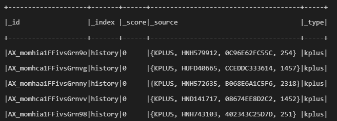
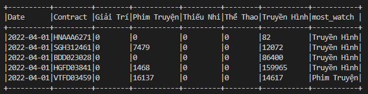
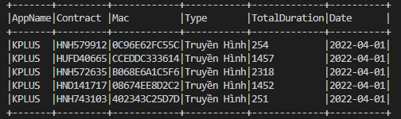
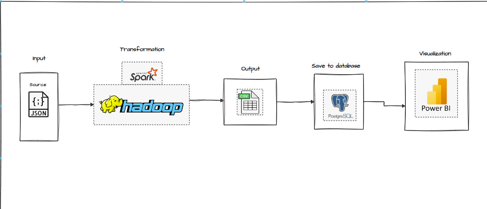
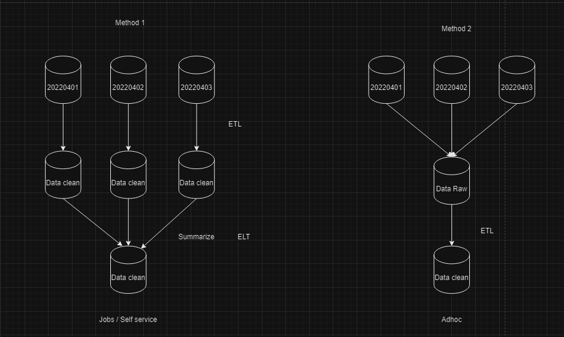
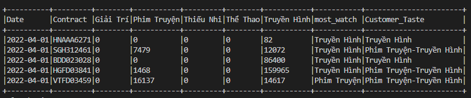
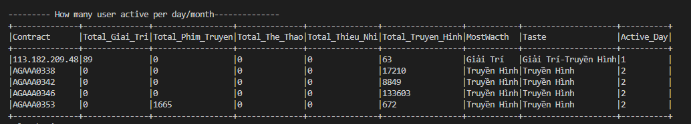

# User Engagement Data Pipeline

## Table of Contents

- [Introduction](#introduction)
- [Input and Output](#input-and-output)
- [Processing Steps](#processing-steps)
- [Data Processing Strategies](#data-processing-strategies)
- [Architecture Overview](#architecture-overview)

## Introduction

The User Engagement Data Pipeline is designed to process user engagement data from various sources. The pipeline reads raw data, transforms it, categorizes user engagement by different types of applications, and finally saves the processed data for further analysis.

## Input and Output

- **Input**: JSON files containing the following fields:
  - `_id`
  - `_index`
  - `_score`
  - `_source`
  - `_Type`

- **Output**: CSV files or database tables containing the following fields:
  - `Contract`
  - `TVDuration`
  - `MovieDuration`
  - `ChildDuration`
  - `RelaxDuration`
  - `SportDuration`

## Processing Steps

To transform the input data into the desired output format, the following steps are performed:

1. **Read Data**: Load JSON files from the specified input directory.
2. **Categorize App Names**: Map `AppName` values to predefined categories.
3. **Summarize Data**: Group by `Contract` and category, then sum the `TotalDuration`.
4. **Pivot Data**: Transform the summarized data to have one column per category.

## Data Processing Strategies

The pipeline can process data in two main ways:

1. **Direction 1**: Read data from all files at once and then calculate. You can see in "job/etl_job_1.py".
2. **Direction 2**: Read and process each file individually, then combine all results and group by `Contract` and sum.You can see in "job/etl_job_2.py".

For efficiency and scalability, Direction 2 is preferred as it allows incremental processing of large datasets.

## Architecture Overview

### 🏛️ Architecture Overview

### ETL Flow

### Root Data

### Data Transformation

### Most Watched Category

### User Taste

### Active User

